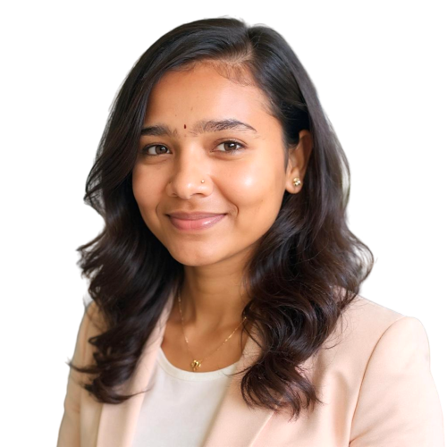

<!-- ===================== HEADER ===================== -->

  <iframe loading="lazy" style="position: absolute; width: 100%; height: 100%; top: 0; left: 0; border: none; padding: 0;margin: 0;"
    src="https://www.canva.com/design/DAHAYNV2Nhg/QXUwZ4BSCWBPLHYGkj6FDQ/view?embed" allowfullscreen="allowfullscreen" allow="fullscreen">
  </iframe>

<a href="https:&#x2F;&#x2F;www.canva.com&#x2F;design&#x2F;DAHAYNV2Nhg&#x2F;QXUwZ4BSCWBPLHYGkj6FDQ&#x2F;view?utm_content=DAHAYNV2Nhg&amp;utm_campaign=designshare&amp;utm_medium=embeds&amp;utm_source=link" target="_blank" rel="noopener">yashaswini mudragadda</a> by Yashaswini Mudragaddda
<h1 align="center">Hi 👋, I'm Yashaswini Mudragadda</h1>
<h3 align="center">Java Full Stack Developer | Frontend Enthusiast | UI/UX Learner</h3>

---

<!-- ===================== HERO SECTION ===================== -->
<table width="100%">
<tr>

<!-- LEFT: PROFILE IMAGE -->
<td width="35%" align="center" valign="top">

</td>

<!-- RIGHT: ABOUT + EDUCATION -->
<td width="65%" valign="top">

## 👩‍💻 About Me

I’m a passionate **Java Full Stack Developer** from India 🇮🇳 who enjoys building
clean, scalable, and user-friendly web applications.

I work with **Java, HTML, CSS, JavaScript, MySQL, React, and Next.js**, and I use
**Figma** to design intuitive UI/UX before development.

Currently, I’m focused on strengthening my **frontend architecture**, improving
**full-stack workflows**, and building real-world projects.

---

</td>
</tr>
</table>

---

## 🎓 Education

**Master of Computer Applications (MCA)**  
📍 India  

**Bachelor of Computer Science**  
📊 **84%**

**Intermediate Education**

---

## 🛠️ Technical Skills

**Languages & Databases**
- Java  
- JavaScript  
- MySQL  

**Frontend**
- HTML5  
- CSS3  
- React.js  
- Next.js  
- Tailwind CSS  

**Tools & Design**
- Git & GitHub  
- Figma  

---

## 🌱 Currently Learning
- Advanced React & Next.js  
- UI/UX Design Principles  
- Scalable Frontend Architecture  

---

## 📫 Contact & Socials
- 📧 **Email:** mudragaddarajaniyashaswini@gmail.com  
- 💼 **LinkedIn:** [yashaswini-mudragadda](https://linkedin.com/in/yashaswini-mudragadda-9180a9252)  
- 💬 **Discord:** yashaswinimudragadda_34982  

---

## 🎯 Career Objective
To grow as a **Full Stack Developer**, contribute to impactful projects, and continuously
improve my technical and design skills.

---

### ⚡ Fun Fact
I enjoy designing UI in Figma before writing any code 😄
